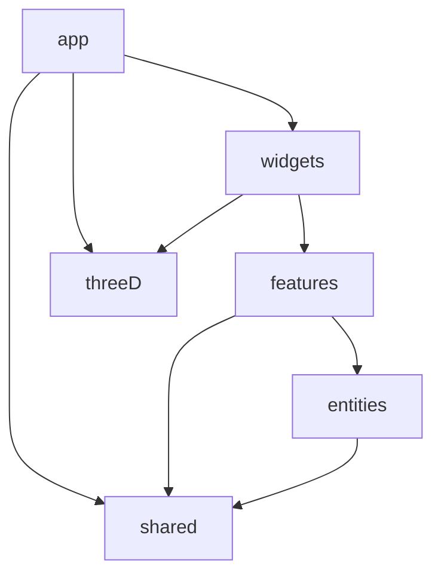

# Refactor Architecture Plan cho TechTonic Website V2

## 1) Architecture Assessment (Hiện trạng + chấm điểm)

- Đánh giá kiến trúc hiện tại là **App Router page-composition với content-driven modules**, chưa đạt feature-sliced đầy đủ.
- Dẫn chứng chính:
  - Entry và route shell ở `[app/layout.tsx](app/layout.tsx)`, `[app/(site)/layout.tsx](app/(site)`/layout.tsx), `[components/site-shell.tsx](components/site-shell.tsx)`.
  - Content tách tương đối tốt ở `[lib/content/index.ts](lib/content/index.ts)` + các file domain content trong `lib/content`.
  - Component/page-level còn phẳng trong `[components](components)`, thiếu boundary theo feature.
- Chấm điểm baseline (để theo dõi sau refactor):
  - Maintainability: **5.5/10**
  - Scalability: **5/10**
  - Readability: **6.5/10**
  - Team collaboration readiness: **4.5/10**

## 2) Refactoring Opportunities (Issue catalog có impact + hướng xử lý)

- Tổng hợp issue theo nhóm: duplicate code, file quá lớn, coupling, naming, complexity, 3D/perf bottleneck, security, testing/tooling debt.
- Dẫn chứng trọng tâm:
  - Duplicate hooks: `[hooks/use-toast.ts](hooks/use-toast.ts)` vs `[components/ui/use-toast.ts](components/ui/use-toast.ts)`, `[hooks/use-mobile.tsx](hooks/use-mobile.tsx)` vs `[components/ui/use-mobile.tsx](components/ui/use-mobile.tsx)`.
  - Large components: `[components/registration.tsx](components/registration.tsx)`, `[components/gallery.tsx](components/gallery.tsx)`, `[components/team.tsx](components/team.tsx)`, `[components/hero.tsx](components/hero.tsx)`.
  - Build gate bị vô hiệu: `[next.config.mjs](next.config.mjs)`.
  - 3D stack chưa được mount hiệu quả: `[components/3d/canvas/canvas-shell.tsx](components/3d/canvas/canvas-shell.tsx)`, `[components/3d/scenes/hero-scene.tsx](components/3d/scenes/hero-scene.tsx)`.
- Mỗi issue sẽ có format chuẩn: **Problem → Why risky → Impact (Low/Medium/High) → Refactor approach**.

## 3) Recommended Project Structure (Feature-Sliced + App Router)

- Đề xuất cấu trúc mục tiêu:
  - `src/app/` cho routing/layout/route handlers.
  - `src/features/` theo business capability (home, recruitment, events, departments, portfolio, about).
  - `src/entities/` cho domain blocks tái dùng (member, event, project, partner).
  - `src/widgets/` cho section-level composition.
  - `src/shared/` cho UI primitives, hooks, utils, constants, configs.
  - `src/3d/` cho scenes, materials, controls, loaders, performance guards.
  - `src/lib/` giữ integration/runtime helpers (analytics, api-client, security).
  - `src/types/` cho shared contracts.
- Kèm rule boundary import để giảm coupling chéo feature.

## 4) Coding Standards (Document chuẩn cho team)

- Soạn chuẩn coding theo nhóm:
  - General: SOLID, DRY, KISS, readability-first.
  - TypeScript: strict, tránh `any`, shared contracts, DTO rõ ràng.
  - React/Next: Server Components mặc định, client boundary rõ, tách UI và business logic qua hooks/services.
  - State management: local-first, chuẩn hóa async state và side effects.
  - API layer: tập trung gọi API ở một lớp, error mapping chuẩn hóa.
  - Naming/folder: file `kebab-case`, component `PascalCase`, export strategy nhất quán, cấm circular dependencies.

## 5) Team Collaboration Rules

- Đề xuất workflow thống nhất:
  - Branch naming: `feature/`, `refactor/`, `bugfix/`, `chore/`.
  - Conventional Commits bắt buộc.
  - PR template + checklist (scope, test evidence, perf/security impact).
  - Review process 2-step: architecture check + behavior/regression check.

## 6) Quality & Tooling Recommendations

- Bật lại quality gates trong build ở `[next.config.mjs](next.config.mjs)`.
- Chuẩn hóa bộ công cụ:
  - ESLint + Prettier + import order.
  - Husky + lint-staged.
  - Commitlint.
  - Testing baseline (Vitest/Jest + RTL) + smoke test critical routes.
  - CI tối thiểu: typecheck + lint + test + build.

## 7) Refactoring Roadmap (4 phases)

- **Phase 1 - Foundation**
  - Goals: chuẩn hóa rules/tooling/CI, bật quality gates, thống nhất conventions.
  - Effort: 3-5 ngày.
  - Risks: phát sinh nhiều lỗi legacy khi bật strict checks.
  - Outcomes: baseline kỹ thuật ổn định cho team collaboration.
- **Phase 2 - Core Refactor**
  - Goals: tách feature boundaries, giảm size component lớn, loại duplicate hooks, chuẩn hóa API/error layers.
  - Effort: 1.5-3 tuần.
  - Risks: regression UI/behavior nếu tách component quá nhanh.
  - Outcomes: codebase modular, dễ onboarding, dễ review.
- **Phase 3 - 3D & Performance**
  - Goals: tối ưu animation budget, lazy-load 3D có chủ đích, chuẩn hóa image loading và scroll performance.
  - Effort: 1-2 tuần.
  - Risks: ảnh hưởng visual fidelity nếu cắt animation không đúng.
  - Outcomes: UX mượt hơn, ổn định trên thiết bị yếu.
- **Phase 4 - Polish & Docs**
  - Goals: hoàn thiện docs kiến trúc/runbook, thêm test coverage trọng yếu, finalize DX.
  - Effort: 4-7 ngày.
  - Risks: thiếu kỷ luật cập nhật docs theo code.
  - Outcomes: dự án sẵn sàng maintain dài hạn bởi nhiều developer.

## 8) Documentation Pack (Deliverable mới theo yêu cầu)

- Tạo bộ tài liệu chính thức gồm 6 file:
  - `ARCHITECTURE.md`
  - `CONTRIBUTING.md`
  - `DESIGN.md`
  - `CODE_STYLE.md`
  - `PROJECT_STRUCTURE.md`
  - `DEVELOPMENT_GUIDE.md`
- Tiêu chuẩn bắt buộc cho cả 6 file:
  - Viết bằng tiếng Anh, tone professional và dễ onboarding.
  - Markdown rõ ràng: headings, lists, code blocks (và table khi phù hợp).
  - Nhấn mạnh định hướng scalable, maintainable, dark futuristic, 3D-ready.
  - Thống nhất với kiến trúc mục tiêu (Feature-Sliced + App Router + 3D layer).
  - Có liên kết chéo giữa tài liệu để tạo “single source of truth”.

### 8.1) Scope cụ thể từng tài liệu

- `**ARCHITECTURE.md`**
  - Current vs Target architecture (V2.0).
  - High-level diagram text-based.
  - Layered architecture và dependency direction.
  - ADR ngắn cho các quyết định công nghệ chính.
- `**CONTRIBUTING.md`**
  - Cách tham gia dự án, branch workflow.
  - Branch naming (`feature/`, `refactor/`, `bugfix/`, `chore/`).
  - Conventional Commits.
  - PR template/checklist và code review guidelines.
- `**DESIGN.md`**
  - Design principles cho futuristic/cyberpunk/dark-first.
  - UI/UX rules, motion language, accessibility baseline.
  - 3D art direction + performance guardrails.
  - Color palette, typography, component philosophy.
- `**CODE_STYLE.md`**
  - Coding standards tổng thể: SOLID/DRY/KISS/readability-first.
  - TypeScript rules, React/Next rules, state/API/error rules.
  - Naming conventions, folder/file naming, comments/docs standards.
  - Security/performance standards (đặc biệt animation + 3D).
- `**PROJECT_STRUCTURE.md`**
  - Cây thư mục mục tiêu đầy đủ dạng tree.
  - Vai trò từng layer/folder.
  - Ví dụ tổ chức feature mới.
  - Rule dependency và naming conventions.
- `**DEVELOPMENT_GUIDE.md`**
  - Environment setup + scripts.
  - Tooling baseline (ESLint/Prettier/Husky/Commitlint/CI).
  - Hướng dẫn chạy/kiểm thử 3D component.
  - Debug playbook cho performance và Three.js.
  - Onboarding checklist cho developer mới.

### 8.2) Acceptance Criteria cho Documentation Pack

- Nội dung nhất quán với scorecard và roadmap ở mục 1-7.
- Mỗi file có cấu trúc rõ, đủ depth để áp dụng thực tế cho team nhiều năm.
- Không mâu thuẫn giữa conventions/code style/workflow.
- `CONTRIBUTING.md` tham chiếu `CODE_STYLE.md`, `ARCHITECTURE.md`, `PROJECT_STRUCTURE.md`, `DEVELOPMENT_GUIDE.md`.

